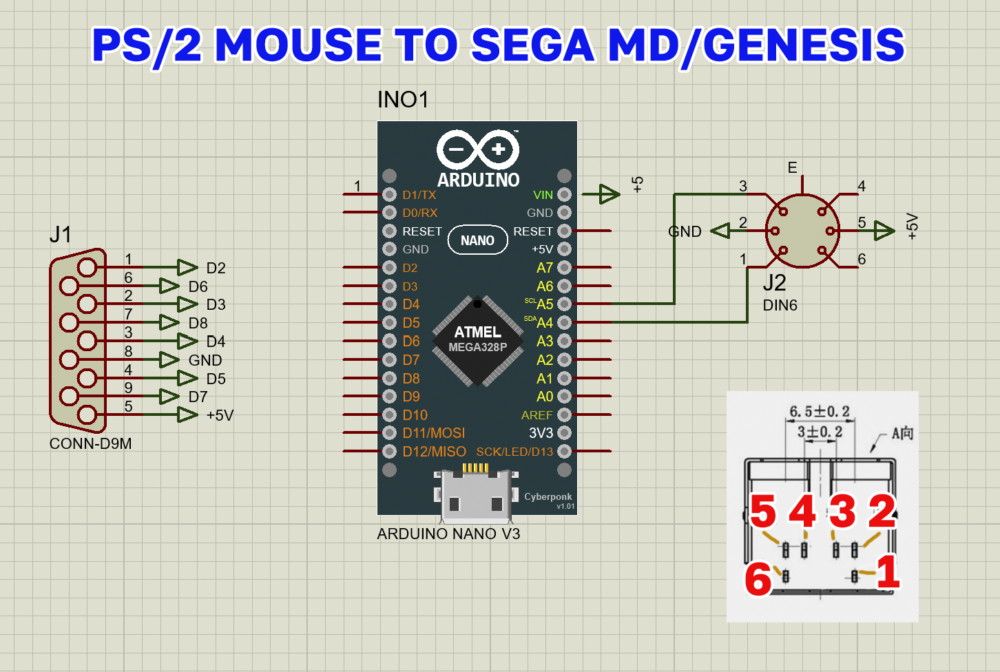
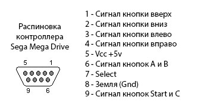

# Mouse-To-SEGA-MD

 
## Подключение к SEGA MD/Genesis  мыши PS/2 вместо контроллера
- Возможна неправильная работа совсем старых мышей (до 2010 г.в.) - проще найти другую, чем разбираться в проблеме
- Более подробная информация: https://youtu.be/K7nqrH6imDc

## Connect to SEGA MD/Genesis PS/2 mouse instead of controller
- Incorrect work of very old mice (before 2010 onwards) is possible - it's easier to find another than to understand the problem
- More information: https://youtu.be/K7nqrH6imDc

